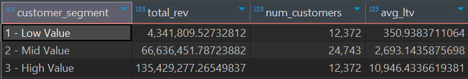

# SQL Project - Sales Analysis
SQL based project mapping customer behaviour with SQL and Sales data.

## OVERVIEW
This project uses PostgreSQL to analyze sales data through cohort analysis, customer retention, and customer lifetime value (CLV). Customers are segmented by acquisition date to track behavior over time, uncover retention trends, and estimate long-term value. Insights support data-driven sales and marketing strategies.

This project uses PostgreSQL to analyze sales data through cohort analysis, customer retention, and customer lifetime value (CLV). Customers are segmented by acquisition date to track behavior over time, uncover retention trends, and estimate long-term value. Insights support data-driven sales and marketing strategies.

## BUSINESS QUESTIONS
The question I have explored in the project are given below:

1. Customer Segmentation – Grouped by calculated customer lifetime value.

2. Cohort Analysis – Tracked revenue patterns across cohorts.

3. Customer Retention – Identified recent vs. inactive customers.

## ANALYSIS
Analysing database to provide meaningful insights and support data-driven conclusions.

### 1. Customer Segmentation
Customers are categorized into low, medium, and high-value groups based on their total lifetime value (CLV). This segmentation helps businesses focus on high-value customers, tailor marketing strategies, and allocate resources effectively to maximize customer retention and overall revenue.

Visit my script for details:
[Customer Segmentation](customer_ltv.sql)

#### Visualization

#### Insights

1. High Value customers (12,372 people) generate 64% of total revenue — showing a strong impact from a relatively small group.

2. Average LTV increases drastically across segments:

3. Low: $351 → Mid: $2,693 → High: $10,946.

4. id Value has the largest customer base (24,743) but still contributes less revenue than High Value.

5. Customer quality > quantity — targeting and retaining High Value customers is crucial.

### 2. Cohort Analysis
Customers are grouped into cohorts based on their first year of purchase.
Each cohort is tracked over time to measure total revenue generated and number of active customers in subsequent periods.
This helped identify customer retention patterns, revenue trends, and the long-term value of each acquisition year.

Visit my script for further details:
[Cohort analysis](cohort_analysis.sql)

#### Visualization

#### Insights

1. **Strongest Cohorts:**
2016 and 2017 cohorts delivered the highest average revenue per customer (₹2,896 and ₹2,893 respectively), highlighting their long-term value.

2. **Post-2019 Revenue Decline:**
Starting from 2020, average customer revenue shows a downward trend, reaching its lowest in 2024 (₹1,972), signaling a shift in customer value.

3. **Stability Before 2020:**
Cohorts from 2015 to 2019 maintained a relatively stable and high revenue per customer, indicating consistent customer quality during that period.

4. **Post-2020 Dip:** 
The drop in customer revenue post-2020 may reflect changing customer behavior, economic conditions, or acquisition strategies that brought in lower-value customers.

### 3. Customer Retention
This section provides a year-over-year analysis of customer retention by examining the number of active versus churned customers in each cohort. For every year, we calculated both the absolute figures and the percentage of customers retained and lost. This analysis helps identify trends in customer loyalty, detect cohorts with high churn risk, and uncover periods where retention strategies may have succeeded or failed.

Visit my script for further details:
[Customer Retention](customer_retention.sql)

#### Visualization 

#### Insights 

1. **High Churn Across All Cohorts:**
Every cohort shows a churn rate above 89%, indicating a significant challenge in long-term customer retention.

2. **Slight Improvement in Recent Cohorts:**
The 2022 and 2023 cohorts show slightly higher retention (10.3% and 9.6% active, respectively), suggesting potential impact of recent engagement strategies.

3. **Consistently Low Retention:**
Retention has remained below 10% for most cohorts, highlighting the need for stronger post-acquisition engagement and loyalty programs.

4. **To improve cuatomer retention use some techniques like:**
Implement Loyalty programs, Excellent Customer Support, Transparent Policies etc.

## TOOLS USED:

- **PostgreSQL** – The database used for storing and managing project data.
- **DBeaver** - Software for running SQL scripts.
- **VS Code** – Software I used for writing and editing the MarkDown file.  
- **GitHub** – Used for version control and sharing project code.  
- **Database Source** – Data obtained from Luke Baraousse’s Intermediate SQL course. 
- **Visualization** - Used ChatGPT for visualizing the data. 

## Conclusion

This project analyzes customer behavior by categorizing them into high, medium, and low-value segments based on their lifetime value. It also includes a cohort analysis to track total revenue and the number of customers by year. Additionally, the project examines average customer revenue and retention trends over the past decade, providing insights into customer retention rates, with a detailed comparison of active versus churned customers, along with their respective percentages. This analysis helps in understanding customer loyalty, identifying key growth areas, and improving overall retention strategies.
